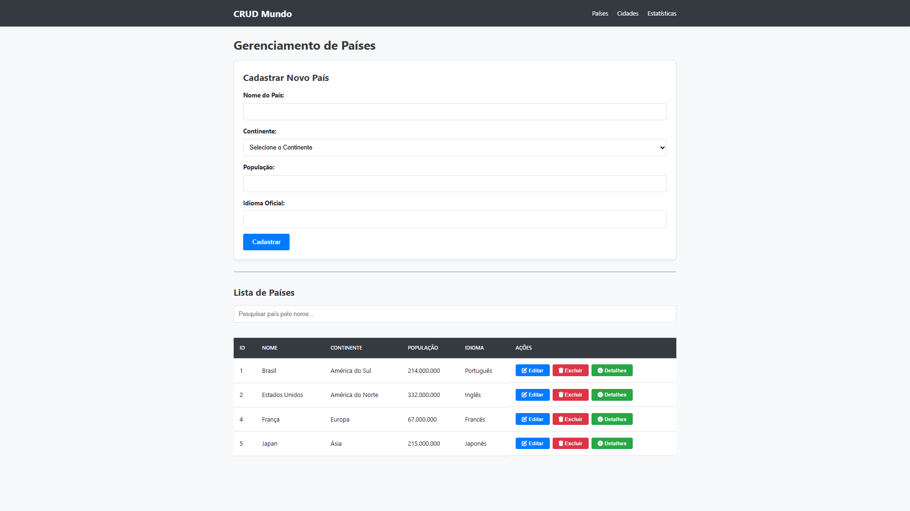
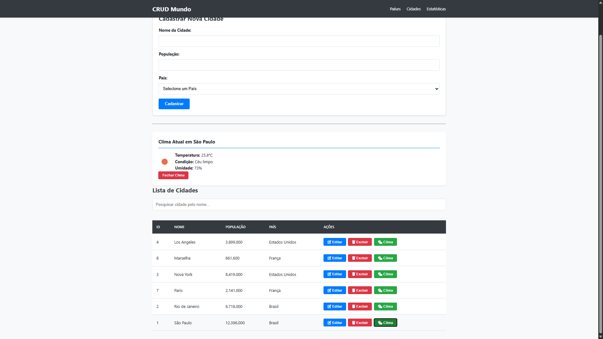

# 🌍 CRUD Mundo

Esse projeto é uma **aplicação web para gerenciamento de dados geográficos**, focado em **países e cidades**. Foi desenvolvido com backend em **PHP**, frontend com **HTML, CSS e JavaScript**, e utiliza **MySQL** como banco de dados para armazenar e manipular as informações.

---

## 🧠 💡 Sobre o Projeto

O objetivo do **CRUD Mundo** é permitir que usuários:
- Cadastrem países
- Cadastrem cidades vinculadas a um país
- Visualizem, editem e removam esses registros

Esse tipo de projeto é ideal para demonstrar suas habilidades com:
- PHP (backend)
- Banco de dados MySQL
- Manipulação de dados (CRUD − Create, Read, Update, Delete)
- Integração entre frontend e backend 

<p align="center">
  
  
</p>

---

## 🛠️ Tecnologias Utilizadas

O projeto foi construído utilizando:

| Tecnologia | Finalidade |
|------------|------------|
| PHP        | Backend e lógica do servidor |
| MySQL      | Gerenciamento do banco de dados |
| HTML       | Estrutura do frontend |
| CSS        | Estilo e layout |
| JavaScript | Comportamento dinâmico na interface | :contentReference[oaicite:4]{index=4}

---

## 🌐 APIs Externas Utilizadas

O projeto integra APIs externas para enriquecer as informações exibidas ao usuário, automatizando dados e melhorando a experiência visual e funcional do sistema.

- **OPENWEATHER API**  
  Utilizada para obter informações climáticas em tempo real, como temperatura e condições do tempo, com base na cidade cadastrada no sistema.

  A comunicação é feita via requisições HTTP utilizando uma chave de acesso (`OPENWEATHERMAP_API_KEY`), com retorno dos dados em formato JSON.

- **REST COUNTRIES API**  
  Utilizada para obter dados dos países, incluindo **bandeiras**, nomes e códigos internacionais, permitindo a exibição visual da bandeira correspondente a cada país cadastrado.

  Os dados retornados pela API são consumidos em formato JSON e utilizados diretamente na interface da aplicação.

---

## 📦 Pré-requisitos

Antes de instalar e rodar o projeto, verifique se você tem instalado:

✔️ Servidor web (Apache ou similar)  
✔️ PHP (versão 7.0 ou superior)  
✔️ MySQL ou MariaDB  
✔️ phpMyAdmin (opcional, para gerenciar o banco)  

---

## 🚀 Instalação & Execução

Siga esses passos para rodar o projeto localmente:

1. Clone o repositório:
   ```bash
   git clone https://github.com/igorcsouzaa/crud-mundo.git
2. Copie os arquivos para a pasta do seu servidor (ex: htdocs no XAMPP ou www no WAMP).

3. Crie um banco de dados no MySQL (ex: crud_mundo).

4. Importe o script SQL para criar as tabelas necessárias.

5. Configure as credenciais do banco no arquivo de conexão do projeto.

6. Inicie o servidor e acesse no navegador:
    http://localhost/crud-mundo
